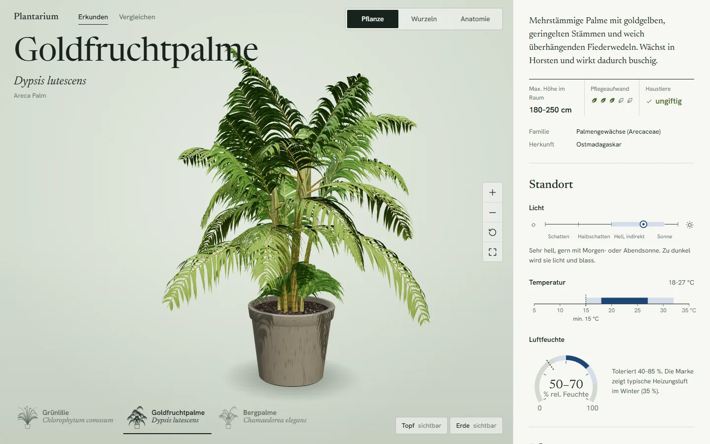
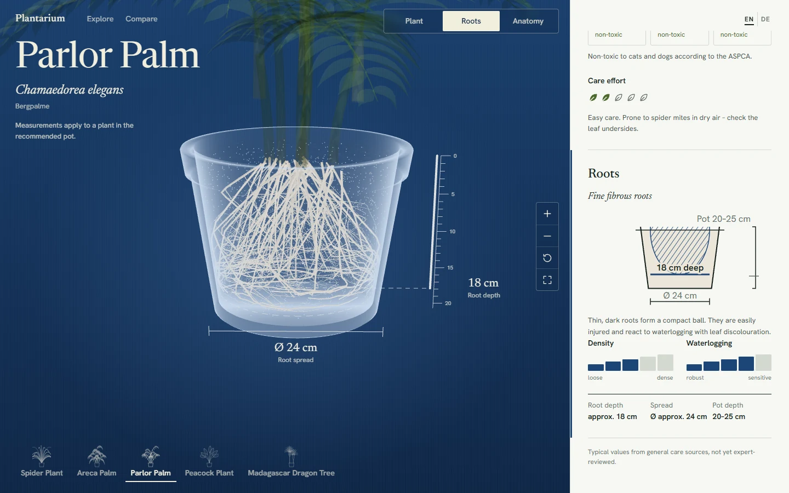
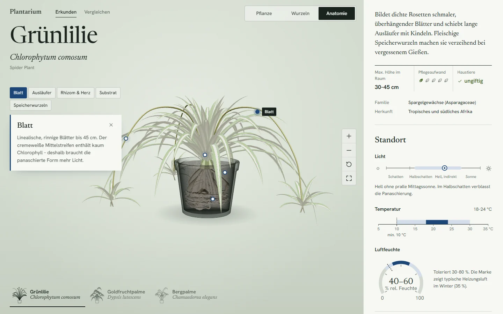
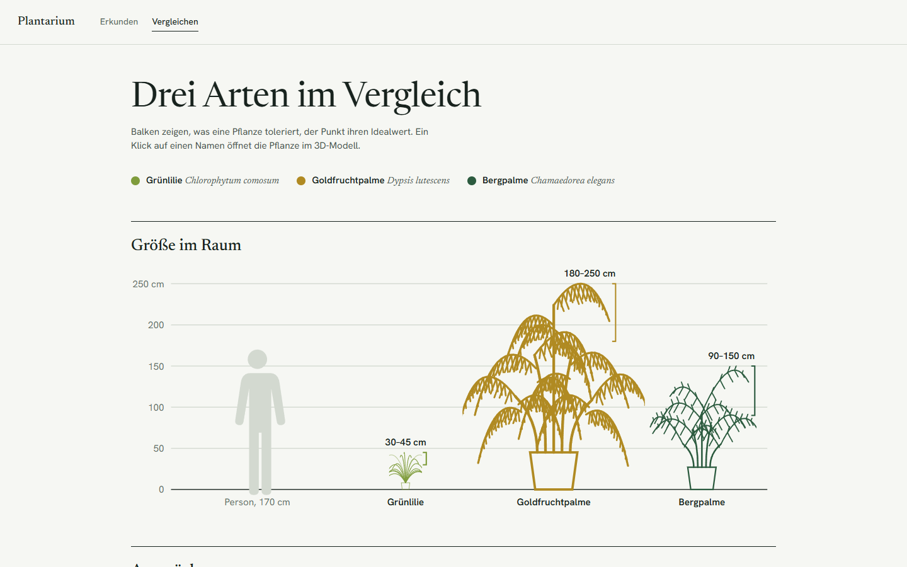
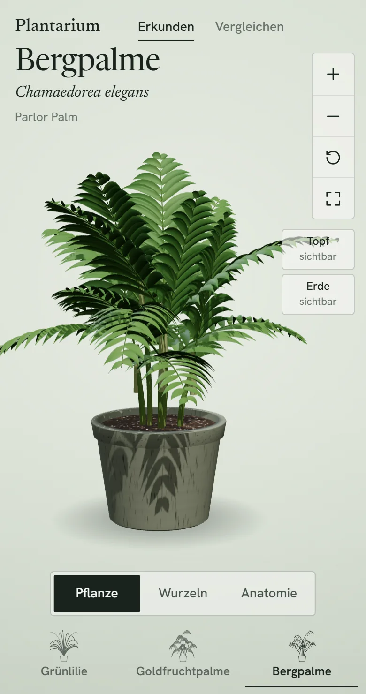
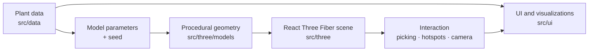

<div align="center">


# Plantarium

**An interactive 3D herbarium for houseplants, from leaf to root.**

[](https://github.com/Luis-0508/plantarium/actions/workflows/ci.yml)
[](https://react.dev/)
[](https://www.typescriptlang.org/)
[](https://r3f.docs.pmnd.rs/)
[](LICENSE)



</div>

## Overview

Plantarium presents each houseplant as a living specimen rather than a list
entry. Every plant is a 3D model you can orbit and inspect, with its root
system grown inside the pot, an anatomy mode that explains the parts of the
plant on the model itself, and a specimen sheet that turns care requirements
into small, readable graphics.

What makes it technically interesting:

- **Procedural plants.** Shoots are generated from a handful of botanical
  parameters (leaf count, frond length, leaflet droop, cane rings) instead of
  being modelled by hand. A new species is mostly a new data entry.
- **Procedural roots.** Root systems grow as constrained random walks under
  gravitropism, deflected by the pot wall and floor, and sized from each
  plant's root profile, so the measurements in the root view match the
  geometry.
- **Deterministic seeds.** Every plant grows identically on every load, which
  keeps camera framing, hotspot positions and measurements stable.
- **Scale awareness.** Pot size, rooting depth and indoor height are real
  dimensions, used both in the 3D scene and in the to-scale comparison.

The interface is available in English (default) and German, switchable in the
header; the code and documentation are in English.

## Screenshots

<table>
  <tr>
    <td width="50%"></td>
    <td width="50%"></td>
  </tr>
  <tr>
    <td><b>Root view.</b> Pot and soil turn transparent, the scene switches to a cyanotype ground and the root system is measured in 3D.</td>
    <td><b>Anatomy view.</b> Hotspots and region picking on the model, with an explanation card per region.</td>
  </tr>
  <tr>
    <td></td>
    <td align="center"></td>
  </tr>
  <tr>
    <td><b>Comparison.</b> A to-scale height lineup and shared-axis trait plots.</td>
    <td><b>Mobile.</b> The stage and specimen sheet stack on narrow screens.</td>
  </tr>
</table>

## Features

**Interactive specimens.** Orbit, zoom, reset and fullscreen. The pot can be
shown, made transparent or hidden, and the soil made transparent, to see how
the plant sits in its container. Switching plants plays a short
shrink-and-regrow transition; foliage moves in a light wind. Plants with sleep movements
(`nyctinasty: true`, such as the Calathea) get a time-of-day switch: the leaves
lie open in the morning and fold upright in the evening.

**Three views of the same plant.**
- *Plant* shows the specimen as it would stand in a room.
- *Roots* fades the foliage, turns the pot into a glass outline and the soil
  into stipple on a Prussian-blue cyanotype ground. A depth scale, a
  root-depth ring and a spread dimension are drawn in the scene.
- *Anatomy* lets you hover or click leaves, stems, crown, soil and roots
  directly on the model or via hotspots, each with a short explanation.

**Specimen sheet.** Light, temperature, humidity, water, a feeding and
repotting calendar, substrate mix, growth rate, size, toxicity for cats, dogs
and humans, difficulty and a root profile diagram, each as a small purpose-built
visualization rather than a table of numbers.

**Comparison.** All plants side by side: a to-scale height lineup next to a
person for reference, plus trait plots on shared axes.

**Responsive layout.** The stage and specimen sheet sit side by side on wide
screens and stack below 900 px, on portrait tablets and phones.

**English and German.** A switch in the header changes all interface text and
plant descriptions between English (the default) and German. The choice is
remembered in the browser, and the page language (`lang`), title and
description follow it.

**Keyboard and accessibility.** `1` `2` `3` switch views, `R` resets the
camera, `+`/`-` zoom and `Esc` closes the anatomy card. The view switch is an
ARIA radio group with arrow-key navigation, controls are labelled, focus is
visible, and animations respect `prefers-reduced-motion`.
On narrow screens a native anatomy selector keeps every region reachable
without a projected hotspot. Closing the card restores focus to its selector.

**Navigation and recovery.** Hash links (`#pflanze/<id>` and
`#vergleich/<id>`) preserve the selected plant, including after reload or
browser back/forward. Legacy links without an ID use the first plant. During
a plant change the model, pot and information switch together at the end of
the shrink animation. If the 3D viewer fails, the information remains available;
the retry button reloads the current URL, also recovering failed Stage chunks.

**GLB path.** Plants can reference a modelled GLB asset instead of a generator,
with a procedural fallback while loading or on failure. This path is prepared
but not yet exercised with a real asset (see [GLB models](#glb-models)).

## How it works

Plantarium is data-driven: each plant is a single typed entry, and everything
on screen is derived from it.



1. A `Plant` entry describes care values, dimensions, pot, root profile,
   anatomy notes and a model reference.
2. For procedural plants, `registry.ts` seeds a generator with the model
   parameters and builds region-separated geometry (`leaves`, `stems`,
   `crown`, `roots`), cached per plant.
3. The stage renders that geometry in a React Three Fiber canvas, derives
   camera framing from robust geometry bounds and eases between views.
4. 3D anchors (hotspots, ruler ticks) are projected each frame onto DOM labels,
   so text stays crisp and accessible instead of being drawn into WebGL.
5. The specimen sheet and comparison page read the same entry and render it as
   SVG graphics.

The 3D stage is loaded as a separate chunk, so the specimen sheet and controls
appear before three.js has finished loading.

## Project structure

```text
src/
  App.tsx           Pages, view state, keyboard shortcuts, URL hash
  data/             What a plant is
    types.ts          Plant schema (metadata, care, dimensions, roots, anatomy, model ref)
    plants.ts         The dataset, with English and German texts
  i18n/             Interface language
    messages.ts       UI strings per language (English is the reference)
    context.ts        Locale context, `useI18n()` and the stored language choice
    LocaleProvider.tsx  Provides the locale and syncs `lang`, title and description
  three/            How a plant is staged
    Stage.tsx         Canvas, lights, camera framing per view
    Specimen.tsx      Pot + plant + roots, view transitions, plant switching, picking
    PlantModel.tsx    Procedural or GLB plant, region materials, load fallback
    Vessel.tsx        Pot, soil, stipple, ground shadow
    RootRuler.tsx     Root-view measuring overlay
    Hotspots.tsx, ScreenAnchors.tsx, anchorRegistry.ts
                      Projects 3D anchors onto DOM labels (ui/StageOverlay.tsx)
    models/         How a plant is grown (pure geometry, no React)
      registry.ts     Builds and caches geometry per plant, bounds, hotspot snapping
      rosette.ts      Rosette generator (Chlorophytum)
      palm.ts         Clustering pinnate palm generator (Dypsis, Chamaedorea)
      calathea.ts     Petiolate leaf clump, two-sided patterned blades (Goeppertia)
      dracaena.ts     Ringed trunks forking into branches with leaf heads (Dracaena)
      roots.ts        Root growth as constrained random walks inside the pot
      geometry.ts     Mesh builder for ribbons and tubes; optional per-vertex leaf
                      motion (pivot, axis, angle) applied in the foliage shader
      rng.ts          Seeded PRNG
  ui/               DOM interface: panel, controls, comparison, glyphs
    viz/              Small SVG data graphics (gauges, scales, calendar, soil mix, roots)
```

The boundaries matter: `data` knows nothing about rendering, `three/models`
produces plain three.js geometry without React, `three` stages it, and `ui`
never touches the scene directly.

## Plant data

Five species are currently included: spider plant (*Chlorophytum comosum*),
areca palm (*Dypsis lutescens*), parlor palm (*Chamaedorea elegans*), peacock
plant (*Goeppertia makoyana*) and Madagascar dragon tree (*Dracaena
marginata*).

Every user-facing text in an entry (names, notes, anatomy, soil components) is
a `Localized` value with one string per language, e.g.
`commonName: { en: 'Spider Plant', de: 'Grünlilie' }`. Interface strings live
in `src/i18n/messages.ts`; the dataset tests require every language to be
filled in.

Each entry carries a `dataQuality` field:

- `placeholder`: typical indoor values compiled from general care guides, not
  yet reviewed. The specimen sheet shows a short note for these entries.
- `reviewed`: values checked against cited sources.

Reusable sources live in `src/data/sources.ts` (ID, title, author/organization,
URL, access date and optional notes). Plants may reference them by subject in
`sourceRefs`: `care`, `dimensions`, `roots` and `anatomy`. The catalog is empty
until real sources are consulted; missing references remain unverified. See
[source-reference guidance](CONTRIBUTING.md#source-references) before reviewing data.

> [!IMPORTANT]
> All current care, size and root values are `placeholder`. They are
> plausible starting points, not authoritative horticultural advice.

## Procedural generation

Four growth forms are implemented:

- **Rosette** (`rosette.ts`): channelled strap leaves in a phyllotactic spiral
  with an optional pale central stripe, plus arching runners carrying
  plantlets. Used for the spider plant.
- **Palm** (`palm.ts`): clustering canes with ring scars, pinnate fronds with
  arching rachises, drooping and irregularly spaced leaflets, age yellowing
  and basal suckers. Used for both palms with different parameters.
- **Calathea** (`calathea.ts`): a dense clump of oval blades on thin petioles,
  with a patterned upper layer and a wine-red underside layer. Each blade
  carries a rotation about its pulvinus, so it rises in the evening pose.
- **Dracaena** (`dracaena.ts`): ringed woody trunks that fork at a knobbly node
  into near-vertical branches, each topped by a fountain of narrow leaves.

Each generator returns geometry for leaves, stems and crown, plus the points
where roots emerge. `roots.ts` then grows the root system from those points:
each root is a random walk pulled down by gravity, smoothed by a slowly
changing wander direction, deflected into circling paths by the pot wall and
flattened at the floor. Depth, spread, density, thickness, branching and
tubers come from the plant's root profile.

All randomness comes from a seeded PRNG (mulberry32), so the same `seed`
always grows the same plant. Changing the seed gives a different individual of
the same species.

## Adding a plant

1. Add a `Plant` entry to `src/data/plants.ts`. All UI reads from this entry.
   Write every text in English and German. Keep `dataQuality: 'placeholder'`
   until the values have been reviewed.
2. Choose a model:
   - **Procedural**: set `model.kind: 'procedural'` with `generator: 'rosette'`,
     `'palm'`, `'calathea'` or `'dracaena'`, tune `params` and pick a `seed`. For a new growth form, add a
     generator in `src/three/models/` that returns `leaves`, `stems`, `crown`
     and `rootOrigins`, and dispatch it in `registry.ts`.
   - **GLB**: see below.
3. Anatomy `anchor` values are hints; for procedural models they snap to the
   nearest vertex of the matching region.

[CONTRIBUTING.md](CONTRIBUTING.md) has the full checklist.

## GLB models

**Status: synthetic GLTF loading and failure recovery are browser-tested.**
No real horticultural GLB asset has been reviewed yet. Changing either model
URL resets the error boundary; the procedural fallback is used during loading
and after an error.

- Files: `public/models/<plant-id>.glb` for the shoot and optionally
  `public/models/<plant-id>-roots.glb` for the roots.
- Data: `model: { kind: 'gltf', url: '/models/<plant-id>.glb', rootsUrl: '/models/<plant-id>-roots.glb', fallback: { kind: 'procedural', ... } }`.
  The optional `fallback` is shown while the file loads and if it fails to
  load (an error boundary catches the failure and logs a warning).
- Scale and origin: metres, Y up, pot rim centre at the origin, soil surface
  just below `y = 0`. The pot and soil are drawn by the app; do not include them.
- Mesh names map to anatomy regions: `leaf_*`/`frond_*`, `stem_*`/`cane_*`,
  `crown_*`/`sheath_*`, `root_*`.
- Not supported for GLB: root-view glow, foliage fading and wind, measured
  ruler positions and hotspot snapping. Hotspots use the raw anchors and
  framing uses `dimensions`.

## Development

Requires Node.js 24 LTS (or newer) and a browser with WebGL 2.

```bash
npm install
npm run dev      # http://localhost:5173
npm run lint     # oxlint
npm run build    # type-check and production build into dist/
npm test         # data and procedural geometry invariants
npx playwright install chromium # once, before browser tests
npm run test:browser # desktop, tablet and mobile smoke checks
```

`npm run preview` serves the production build. CI runs lint, build, unit tests
and Chromium browser tests on every push to `main` and every pull request.
`npm run test:watch` runs the unit suite during development.

A Remotion showcase video, captured from the running app, lives in
[`video/`](video/README.md) as a separate npm project.

Built with [Vite](https://vite.dev/), [React 19](https://react.dev/),
TypeScript, [three.js](https://threejs.org/),
[React Three Fiber](https://r3f.docs.pmnd.rs/) and
[drei](https://drei.docs.pmnd.rs/). Typefaces are Newsreader and Hanken
Grotesk, loaded from Google Fonts.

## Roadmap

Directions the current architecture is built to support, in no particular
order:

- More procedural growth forms (upright foliage plants, trailing vines, ferns)
- Reviewed, sourced horticultural data replacing the placeholder values
- A broader plant catalogue
- GLB support tested end to end, including root-view effects and hotspot snapping
- Broader real-device performance and browser compatibility coverage
- Adaptive rendering quality for lower-end devices
- Simulated growth of shoot and roots over time

## Contributing

Contributions are welcome. See [CONTRIBUTING.md](CONTRIBUTING.md) for setup,
workflow, adding plants and growth forms, and data-quality rules.

## License

[GNU Affero General Public License v3.0](LICENSE)
